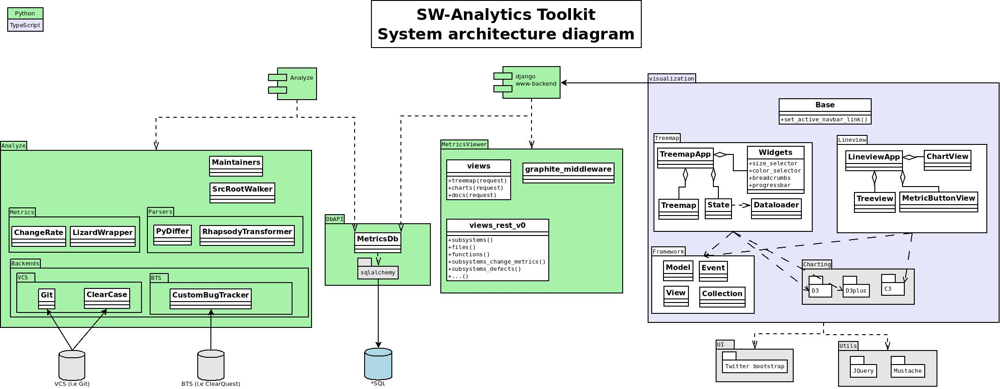

#SWAT: SW-analytics toolkit
A platform for scraping, measuring, visualizing and drawing data-driven conclusions out of software data.

CI status:  

It consists of 3 parts:  
  1. Analyzer (scrapes version-control-systems and bugtrackers and pushes data into a RDBMS)  
  2. www-backend (serves content and performs queries through a RESTful API)  
  3. www-frontend (visualization for metrics on client side).  

##Overall architecture

## General installation
### requirements
####python requirements
   1. [Python 2.7.10](https://www.python.org/downloads/)  
   2. [pip](https://www.python.org/downloads/)  
      Pip should be installed together with Python as of 2.7.9
   3. Install additional python requirements by doing:

        $>pip install -r pip-requirements.py  

### project configuration
1. Create **project.config**  
   Copy project.config.template -> project.config  
   Follow the comments in the file to make sure everything is configured properly.

2. Configure **MAINTAINERS**  
   This file contains a list of all subsystems (a list of inclusion/exclusion pattern rules).

## Creating a database and doing analysis of repo
Creating a database is done through the script **analyze.py**  
You can either cumulatively update, or analyze everything as defined in project.config.
If you are analyzing a git repo, you should also define the repo_root in the project.config file (under 
db_update section). 

## Running the www frontend
The www frontend is based on the [django web framework](https://www.djangoproject.com/)
You first need to configure django to be able to run the development server, you do that by:

1. Copy **www/MetricsViewer/MetricsViewer/local_settings.py.example** -> **www/MetricsViewer/MetricsViewer/local_settings.py**  
   Follow the comments inside that file on how to properly configure it.  
2. Start the server  
   It will use whatever database as defined in **project.config::[MetricsViewer][engine_url]**

        $>python www/MetricsViewer/manage.py runserver  

   By default, the development server will start to listen on http://localhost:8000

More frontend information:  
1. [Usability](/docs/frontends/django_usability.md)  
2. [Implementation details](/docs/frontends/django_implementation.md)

